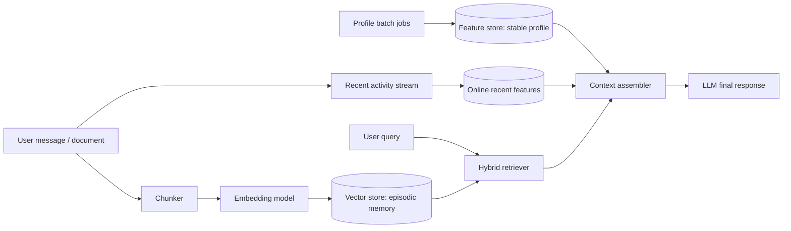

# Hybrid Memory Assistant POC

Contributors: Diem Cong Thanh

## Architecture

This proof of concept keeps the lab concepts but removes production services so
it can run anywhere. Episodic memory is stored in a Qdrant in-memory collection
with one payload field for `user_id`, one short text chunk, and a topic hint.
Stable user profile and recent activity are represented by an online-feature
stub in `HybridMemoryAgent`: it returns the same kind of values a Feast online
lookup would return, such as `topic_affinity`, `preferred_language`,
`reading_speed_wpm`, `active_hours`, and `queries_last_hour`. The `recall()`
method combines both sides: retrieve top memories, fetch online features, then
assemble a context string that an LLM could consume.

## Decision 1: Chunking Strategy

I use paragraph-first chunks with a small word cap. A document or conversation is
split on blank lines first, then long paragraphs are split into short word
windows. I considered per-message storage only, but rejected it for documents
because a long note about Kubernetes, autoscaling, and security would become one
oversized vector. Oversized chunks reduce retrieval precision: a query about
cloud security may retrieve the whole note even when only one paragraph is
relevant. I also considered sentence-level chunks, but that increases storage
cost and creates fragments with too little context. Paragraph-first is the
middle ground: good enough retrieval quality, moderate storage, and compact
context assembly.

The tradeoff is context continuity versus index size. Larger chunks preserve the
story of a conversation but waste context window tokens when only one detail is
needed. Smaller chunks improve matching but require more vectors and a reranker
or RRF step to reconstruct the complete answer. For this POC, clarity matters
more than raw throughput, so the chunker is simple and deterministic.

## Decision 2: Feature Schema

The stable profile uses tabular features instead of embedding features:
`preferred_language`, `reading_speed_wpm`, `topic_affinity`, `active_hours`, and
`learning_goal`. Entity is `user_id`; source is profile batch or user settings;
TTL is long, about 30 days, because these values change slowly. Recent activity
uses `queries_last_hour` and `recent_topics`; entity is also `user_id`; source is
streaming query logs; TTL is short, about one hour.

I considered storing latent preference embeddings in the feature store, but I
chose explicit tabular features for the POC because they are easier to inspect
and safer to use in prompts. A hidden preference vector may be powerful, but it
is hard to explain why the assistant recommends cloud security instead of MLOps.
The tabular schema also maps directly to Feast feature views from NB4 and keeps
point-in-time semantics obvious for training data.

## Decision 3: Freshness Strategy

Not all memory needs the same freshness. A user-saved note should be searchable
within seconds, so `remember()` writes directly to the vector store. Recent query
activity should update sub-second to a few seconds through streaming or push
features, because a query like "what am I focused on lately?" is useless if it
lags by a day. Stable profile features can refresh every day or every week; a
reading-speed estimate does not need immediate updates after one article.

The tradeoff is cost and operational complexity. Sub-second freshness requires a
streaming path, idempotency, and online writes. A daily batch is cheaper and more
reproducible, but it cannot support immediate personalization. The POC therefore
uses immediate in-process updates for episodic memories and recent queries, and
static profile rows for stable preferences.

## Rejected Alternative

I considered storing episodic memory inside the feature store as an embedding
feature view. I rejected it because episodic memory and user profile have
different access patterns and rebuild cycles. New memories can arrive many times
per hour and need nearest-neighbor retrieval. Profile features are small,
key-value lookups with TTL and point-in-time joins. Keeping them separate makes
the system easier to debug and mirrors the lab: vector store answers "what is
relevant?", feature store answers "who is this user right now?"

## Vietnamese Context

Vietnamese users often code-switch: "summary cloud security", "Kubernetes tự mở
rộng", or "recommend đọc gì tiếp". The POC deliberately keeps Vietnamese and
English terms in memory text and queries. For a real system I would evaluate
`bge-m3` or another multilingual model instead of the lite English-focused
embedding model. Tokenization is also important: whitespace split is acceptable
for a small demo, but production Vietnamese retrieval should test pyvi,
underthesea, or a model tokenizer. Privacy is another local consideration:
personal notes may contain phone numbers, finances, or health details, so every
vector query must be filtered by `user_id`, and production should add encryption
at rest plus deletion workflows.

## What This POC Does Not Handle Yet

This POC does not implement durable storage, encryption, delete/update memory
CRUD, multi-device sync, or a real Feast registry. It also does not call an LLM;
`recall()` only returns the assembled context. Those omissions are intentional:
the goal is to demonstrate the architecture decision points from the lab before
adding service complexity.
